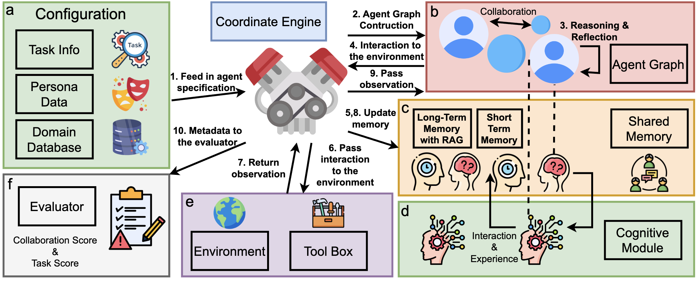

<h1 align="center">MARBLE</h1>

**M**ulti-**A**gent Coo**R**dination **B**ackbone with **L**LM **E**ngine

<div style="display: flex; justify-content: center;">
  <div style="width: 30%;">
    
  </div>
</div>


**MultiAgentBench** is a modular and extensible framework designed to facilitate the development, testing, and evaluation of multi-agent systems leveraging Large Language Models (LLMs). It provides a structured environment where agents can interact within various simulated environments, utilizing cognitive abilities and communication mechanisms to perform tasks collaboratively or competitively.

---

## Table of Contents

- [Features](#features)
- [Architecture](#architecture)
  - [Folder Structure](#folder-structure)
  - [Key Components](#key-components)
- [Installation](#installation)
  - [Prerequisites](#prerequisites)
  - [Setup Steps](#setup-steps)
- [Usage](#usage)
  - [Running the Simulation](#running-the-simulation)
  - [Configuration](#configuration)
- [Contributing](#contributing)
- [License](#license)
- [Contact](#contact)

---

## Features

- **Modular Design**: Easily extend or replace components like agents, environments, and LLM integrations.
- **Multi-Agent Support**: Model complex interactions between multiple agents with hierarchical or cooperative execution modes.
- **LLM Integration**: Interface with various LLM providers (OpenAI, etc.) through a unified API.
- **Shared Memory**: Implement shared memory mechanisms for agent communication and collaboration.
- **Flexible Environments**: Support for different simulated environments like web-based tasks.
- **Metrics and Evaluation**: Built-in evaluation metrics to assess agent performance on tasks.
- **Industrial Coding Standards**: High-quality, well-documented code adhering to industry best practices.
- **Docker Support**: Containerized setup for consistent deployment and easy experimentation.

<div style="display: flex; justify-content: center;">
  <div style="width: 100; transform: scale(1.0);">
    
  </div>
</div>


---


### Install from scratch

Use a virtual environment, e.g. with anaconda3:

```bash
conda create -n marble python=3.10
conda activate marble
curl -sSL https://install.python-poetry.org | python3
export PATH="$HOME/.local/bin:$PATH"
```

### Configure environment variables
Environment variables such as `OPENAI_API_KEY` and `Together_API_KEY` related configs are required to run the code. The recommended way to set all the required variable is
1. Copy the `.env.template` file into the project root with the name `.env`.
```bash
cp .env.template .env
```
2. Fill the required environment variables in the `.env` file.

### Running the examples
To run examples provided in the `examples`:

```bash
poetry install
cd scripts
cd werewolf
bash run_simulation.sh
```

#### New branch for each feature

`git checkout -b feature/feature-name` and PR to `main` branch.

#### Before committing

Run `poetry run pytest` to make sure all tests pass (this will ensure dynamic typing passed with beartype) and `poetry run mypy --config-file pyproject.toml .` to check static typing. (You can also run `pre-commit run --all-files` to run all checks)

#### Check github action result

Check the github action result to make sure all tests pass. If not, fix the errors and push again.

## Citation
Please cite the following paper if you find Marble helpful!
```bibtex
@misc{zhu2025multiagentbenchevaluatingcollaborationcompetition,
      title={MultiAgentBench: Evaluating the Collaboration and Competition of LLM agents}, 
      author={Kunlun Zhu and Hongyi Du and Zhaochen Hong and Xiaocheng Yang and Shuyi Guo and Zhe Wang and Zhenhailong Wang and Cheng Qian and Xiangru Tang and Heng Ji and Jiaxuan You},
      year={2025},
      eprint={2503.01935},
      archivePrefix={arXiv},
      primaryClass={cs.MA},
      url={https://arxiv.org/abs/2503.01935}, 
}
```

<p align="center">
<a href="https://star-history.com/#Significant-Gravitas/AutoGPT">
  <picture>
    <source media="(prefers-color-scheme: dark)" srcset="https://api.star-history.com/svg?repos=MultiagentBench/MARBLE&type=Date&theme=dark" />
    <source media="(prefers-color-scheme: light)" srcset="https://api.star-history.com/svg?repos=MultiagentBench/MARBLE&type=Date" />
    
  </picture>
</a>
</p>

